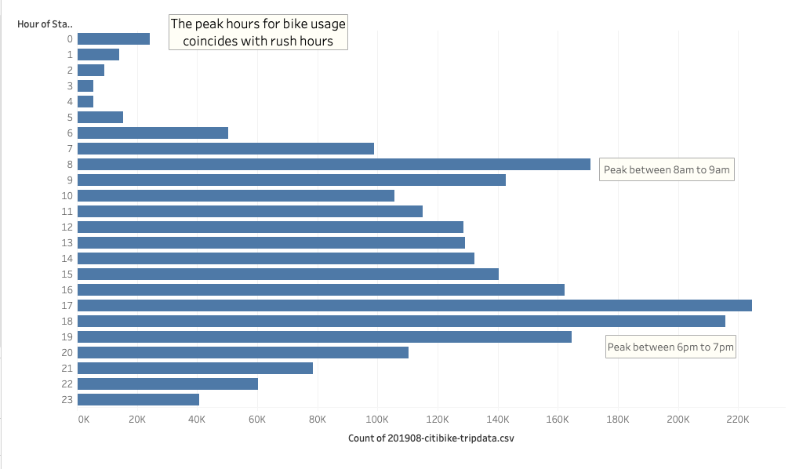
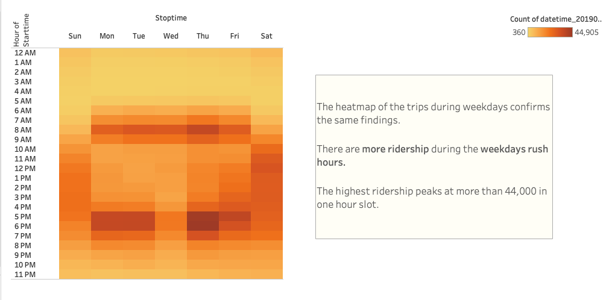
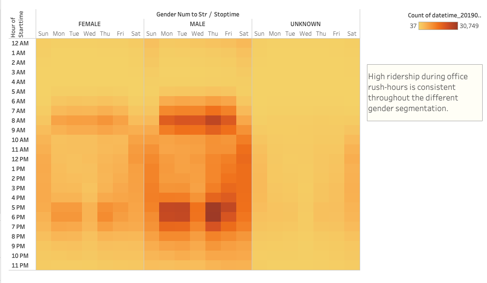
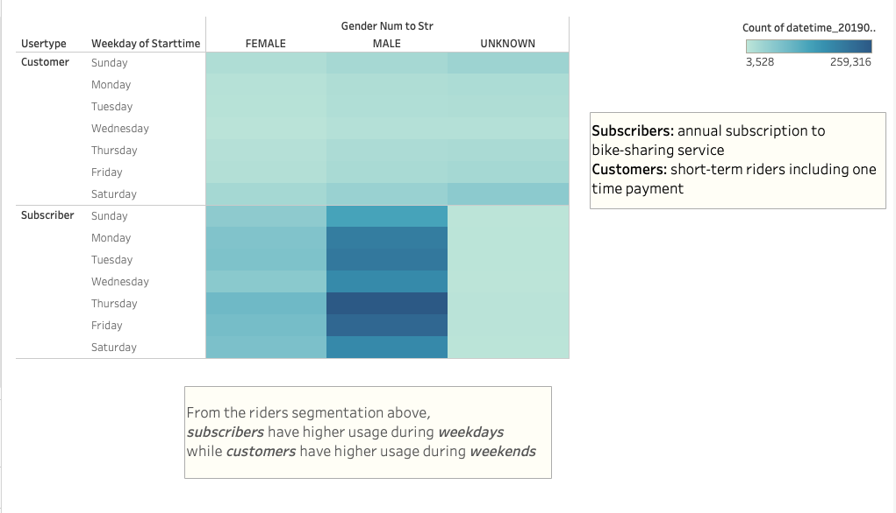
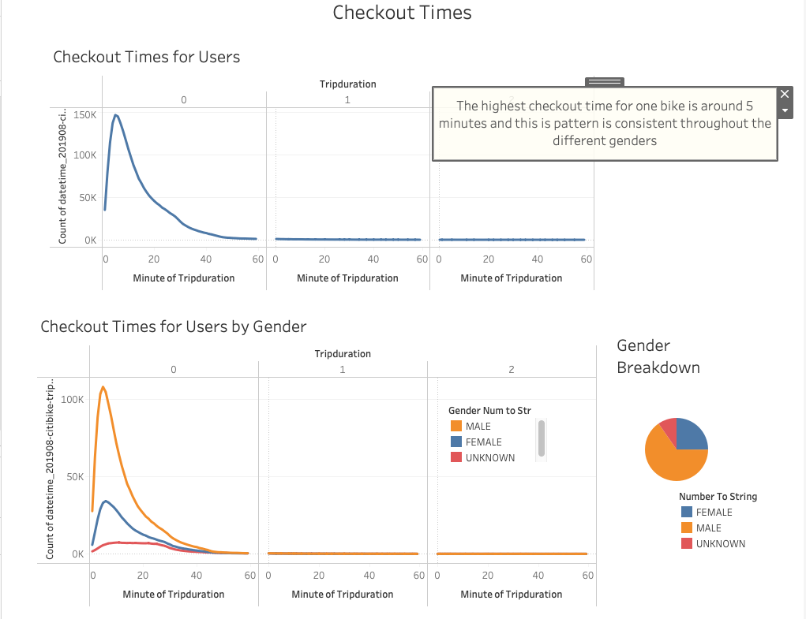

# bikesharing

## Background

Kate suggests that you use Citi Bike data that has been released to the public for your analysis. You agree, but then remind her that you must be cautious when looking at the data, as it applies specifically to New York City—Des Moines is quite different!

You're excited to find out which data will and will not apply to Des Moines, drawing on both your data expertise and critical thinking skills. You'll also need to rely on Kate's salesmanship during the investor conversations. Kate can sell almost anything, but it's up to you to make sure she's selling something viable.

This zip file contains all the August 2019 data. We'll use data from August because there is likely more traffic during the summer months.

You know that you want to use Tableau to create effective visualizations from the Citi Bike data, which Kate can then use to impress potential investors. You also know that the key to getting a good visualization—and, really, any good data analysis—is to start with a question. But what is the right question to ask and how do you portray the answer accurately?

## Overview of Project

The core issue we need to think about is what we absolutely need to know in order to create our bike-sharing program in Des Moines.

Once you know the questions you want to ask, the next thing you need to think about is how your audience will perceive the data you present. You want to share your findings in a way that reduces your personal bias and accurately represents what the data is saying.

Honesty and integrity in regard to your data is an important concept in data science. A person's opinion can be swayed based on how the data is represented, so you need to consider how your audience will perceive and interpret the results and visualization that you show them.

What's the total bike trips in August? Another piece of data you'll want to look into is the number of short-term customers and annual subscribers to the Citi Bike service. This will help us determine the types of customers we could expect for a bike-sharing company in Des Moines. Specifically, you want to find out how the proportion of short-term customers to annual subscribers has changed. Next we want to explore the types of customers. In particular, we want to find the proportion of short-term customers of the bike service to the annual subscribers. Within the Usertype dimension, you'll notice that there are two types of users: subscribers and customers. "Subscribers" refers to annual subscribers of the bike-sharing service, while "customers" are the short-term riders. We now know the breakdown of rider types in New York City, which will help us predict the customer breakdown in Des Moines and, in turn, propose a business model to investors.

A key piece of data we need is the peak usage hours for the month of August. This will help us get a better idea of how many bikes we might need in Des Moines, as well as figure out during which parts of the day we'll need the most bikes. For example, if we need to do maintenance on a bike, knowing the peak usage hours will help us plan for the best time to do that.

What are the highest-traffic locations? Understanding both when and where people use Citi Bike will help you plan your pilot in Des Moines. We'll be creating a basic symbol map to visualize the top 10 starting locations. A symbol map is a map with symbols that correlate to the numeric value of the map location. The most popular starting locations will be marked by larger symbols on the map.

Another question we have for the data—beyond the where and when—is the who. What can the data tell us about the riders themselves? Often, the first place we start when understanding a population is gender.

You've unpacked the when, the where, and the who, but what about "how long"? You need to determine the average ride duration. We know the breakdown of riders by gender, but learning other details about the riders will further assist our analysis. Let's take a look at the average duration of a bike ride, by age. This will help us set expectations for trip duration in Des Moines.

What might the key costs be in a bike-share business? You mull over this question until inspiration strikes: beyond the initial setup, bike maintenance will likely be one of the biggest expenses. So, what can the data tell us about the upkeep bikes might need? A likely concern of investors is the cost of bike upkeep. The bikes used most frequently will probably be the ones that require the most maintenance, so we'll need to determine which bikes have the highest sum of "Number of Rides."

Your investors are curious about the bike utilization during the month of August. You'll need to show the utilization of each Citi Bike in New York City. This will continue to help you understand the needs of a bike-sharing business in Des Moines. Now that we've found the number of trips per bike during the month of August, we should figure out how long those rides are and if there are bikes that need more attention than others. We'll use the bike ID as a metric for this part of the analysis and create a packed bubbles visualization.

Now that we've started to answer some questions with our data, we need to begin piecing it all together. Each of these pieces will lead us closer to being able to tell a story with our data. Let's explore the role of Tableau dashboards in the data storytelling process. In Tableau, dashboards can help us identify areas that might need to be explored more deeply. For example, if one map seems to have more popular locations, we may need to look more closely at how many bikes are stationed in those areas and whether there are enough of them.

We want to show investors the most important relevant data so that they will support the Des Moines bike-sharing business.

Congratulations—your investors were impressed with your work on the NYC Citi Bike Dashboard. The data was readable and digestible. Now they want something that tells a story about the data you presented. It's time to convince them that this bike-sharing idea could work in Des Moines, Iowa.

Dashboards are intended as a way to view data side by side. Stories also allow us to view different data simultaneously, but their main purpose is to tell a story, share a point of view, or convince an audience to take a particular stance.

The purpose of this story is to help them determine whether they should invest in a bike-sharing program in Des Moines.

To solidify the proposal, one of the key stakeholders would like to see a bike trip analysis.

For this analysis, you’ll use Pandas to change the "tripduration" column from an integer to a datetime datatype. Then, using the converted datatype, you’ll create a set of visualizations to:

Show the length of time that bikes are checked out for all riders and genders
Show the number of bike trips for all riders and genders for each hour of each day of the week
Show the number of bike trips for each type of user and gender for each day of the week.
Finally, you’ll add these new visualizations to the two you created in this module for your final presentation and analysis to pitch to investors.

### Purpose

To solidify the proposal, one of the key stakeholders would like to see a bike trip analysis.

For this analysis, you’ll use Pandas to change the "tripduration" column from an integer to a datetime datatype. Then, using the converted datatype, you’ll create a set of visualizations to:

1. How many bike trips were recorded during the month of August? Since August is a beautiful time of the year to rent a bike, we want to use this data as a starting point to determine how many rides we could expect in the city of Des Moines.
2. How does ridership grow over time? What is the proportion of short-term customers to annual subscribers?
3. What are the peak riding hours in the month of August?
4. What are the top bike stations in the city for Starting a journey?
5. What are the top bike stations in the city for Ending a journey?
6. What is the gender breakdown of active riders? Citi Bike tells us that 0 represents "Unknown," 1 represents "Male," and 2 represents "Female."
7. What is the average trip duration by age? In general, the later the birth year, the longer the ride duration.
8. Which bikes are most likely de for repair?
9. How variable is bike utilisation?

Additional:
10. Show the length of time that bikes are checked out for all riders and genders
11. Show the number of bike trips for all riders and genders for each hour of each day of the week
12. Show the number of bike trips for each type of user and gender for each day of the week.
13. Finally, you’ll add these new visualizations to the two you created in this module for your final presentation and analysis to pitch to investors.

## Analysis And Challenges

## Methodology: Analytics Paradigm

#### 1. Decomposing the Ask

* Deliverable 1: Change Trip Duration to a Datetime Format
* Deliverable 2: Create Visualizations for the Trip Analysis
* Deliverable 3: Create a Story and Report for the Final Presentation

What questions would you want answered if you were opening a bike-sharing business?
My questions be:
1. What's the ridership in NYC?
2. Who are using the services?
3. How are they paying?
4. Profitability per trip / per user?
5. Any recurring revenues? Return clients?
6. How far do they ride? Use an average minutes-to-km calculation. This will help manage the pickup/dropoff stations.
7. Are the riders local or tourist?
8. From the peak and off-peak ridership data, can we make an assumption why they are using the bikes?
9. Are the use cases above transferrable to Des Moines?

#### 2. Identify the Datasource
From https://ride.citibikenyc.com/system-data.
August 2019 data: 201908-citibike-tripdata.csv.zip

Datetime type August 2019 data AFTER Pandas manipulation: datetime_201908-citibike-tripdata.csv

### 3. Define Strategy & Metrics
**Resource:** Tableau, Python, Pandas, Jupyter Notebook

#### 4. Data Retrieval Plan
Stated in [2. Identify the Datasource](#2-identify-the-datasource)

#### 5. Assemble & Clean the Data
Usertype dimension, there are two types of users: subscribers and customers. "Subscribers" refers to annual subscribers of the bike-sharing service, while "customers" are the short-term riders

#### 6. Analyse for Trends
Most of the riders are annual subscribers and uses the bike for short trips.

#### 7. Acknowledging Limitations
We do not have information on the financials to be able to tell us on revenue, profit, operational expenses to be able to suggest to the investors on this business in a succinct way.

#### 8. Making the Call:
The "Proper" Conclusion is indicated below on [Summary](#summary)

## Analysis

[Link To Tableau Public Dashboard](https://public.tableau.com/app/profile/suyin.b/viz/ModuleChallenge14_16441207136770/NYCCitibikeAnalysis-Story#1)

NYC Citi Bike utilisation for August 2019 is 2.34M with a large percentage of the annual subscription users. The top starting stations are all located within Manhattan.

>Peak Hours

As we can see from the above chart, the peak usage for the bikes coincides with rush hours at 8am-9am and 6pm-7pm.

>Week Days Start Time Heatmap

The weekdays heatmaps is consistent with the usage of bikes during peak hours. There are more ridership during the weekdays rush hours. The highest ridership peaks at more than 44,000.

>Week Days Start Time Heatmap by Gender

High ridership during office rush-hours is consistent throughout the different gender segmentation.

>Subscribers VS Customers

From the riders segmentation above, subscribers have higher usage during weekdays while short-term customers have higher usage during weekends.

>Checkout Times

The longest checkout time for one bike is around 5 minutes and this is pattern is consistent throughout the different genders.

## Summary

There are higher annual subscription riders in NYC compared to short-term riders for Citi Bike.

USA Census in 2021
Des Moines Population: 709,466
New York City Population: 8,820,000

While the data from NYC is very positive for implementing a similar setup in a different city, we have enough data to answer these questions regarding Des Moines, Iowa:
1. Is Des Moines walkable / have bike lines? What is the local transit infrastructure like?
2. Is the city sprawling? If it is, then the general assumption is most people have cars and prefer to drive.

## Appendix

DESIGNING DASHBOARD

The main purpose of a dashboard is not necessarily to tell a story, but rather to display data in a readable format.

When designing a dashboard, it's important to prioritize which worksheets go on the dashboard first. Generally, the first worksheet will be the most prominent and show the most informative data, so be sure to get the data you care the most about on the page first.

Let's look at a few key aspects of designing a dashboard: purpose and audience, filtering, highlighting, and objects.

PURPOSE & AUDIENCE

It's important to understand who your audience is when creating a dashboard in order to ensure the data is relevant to them. For example, an executive may be more interested in the specific locations where bikes will be stored, while a developer may want to know specific data about the site, like the location, number of people using it, and more.

FILTERING

Filtering plays a big role in operability of your dashboard. You can use filters to display certain subsets of data.

HIGHLIGHTING

The highlighting feature allows you to select subsets of data. To highlight, drag your mouse over a data subset, which will essentially filter out everything but the data you selected.

OBJECTS

Most of the time, you'll add worksheets to your dashboard, but occasionally you may need to add links or photos. For example, you may want to add your company logo at the top of a worksheet, or add a link to an external website. You can add both of these items to your dashboard using the objects. You can drag these objects into your dashboard. You should be aware of two types of objects: tiled objects and floating objects. Tiled objects are essentially a structured way to arrange your dashboard. Floating objects allow you to change the size of the object and can overlap with other objects.

STRUCTURING WORKSHEETS IN A DASHBOARD

Worksheets in your dashboard should be structured in an organized, thoughtful way. Include a title for your worksheet, and put the most important data in the top left corner. This is where your eyes will gravitate to first, so make it easy to read.
After adding the most important information in the top left, you can add more information on the right. Most of the time, your audience will read the information in the dashboard from left to right. Then, place the rest of the worksheets around your primary worksheet.
Remember, structuring worksheets is a muscle that you will build over time—but it takes practice!

ENSURE FAST LOAD TIME

Something you need to consider is the load time for your data, which can be affected by the data source you're using. For example, if you're using a database from a database server, Tableau will need to query the database. Depending on how much data there is, your dashboard can be slowed down significantly.

---
STORIES

CREATE A STORY

Stories do this by sequencing visualizations to help the audience understand the bigger picture. In our case, we want to create a story that explains why you think, given the data, that starting a bike sharing company in Des Moines is a good idea.

ADD STORY POINTS

Tableau stories have a feature called story points. Story points are simply different points you would like to make about your data. Think of them like the pages in a graphic novel. No image is the same, but they are all part of the larger story. This is the goal of story points.

DATA VISUALISATION PROCESS

When creating Tableau stories, or data visualizations in general, there's a general process that should be followed. You can use this process for most visualizations you'll create.

1. Select your questions. During this step, you'll consider which results you want to share with your audience. What do they want to see? How can we use that information to make their decision-making process easier?
2. Execute independent research. You'll need to look at other relevant pieces of information to build a bigger picture. Search other sources to find information that will make your visualization more powerful.
3. Craft your Tableau story. This is when you create your story, primarily from worksheets and other visuals, with descriptions for each of them.
4. Create a written analysis. The written analysis is intended to provide additional insight into what we're trying to convey to our audience. This is a good place to add extra detail so that everyone can get on the same page.
